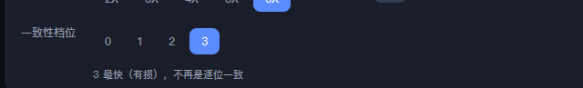
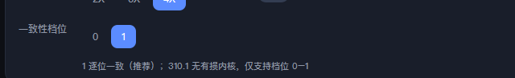
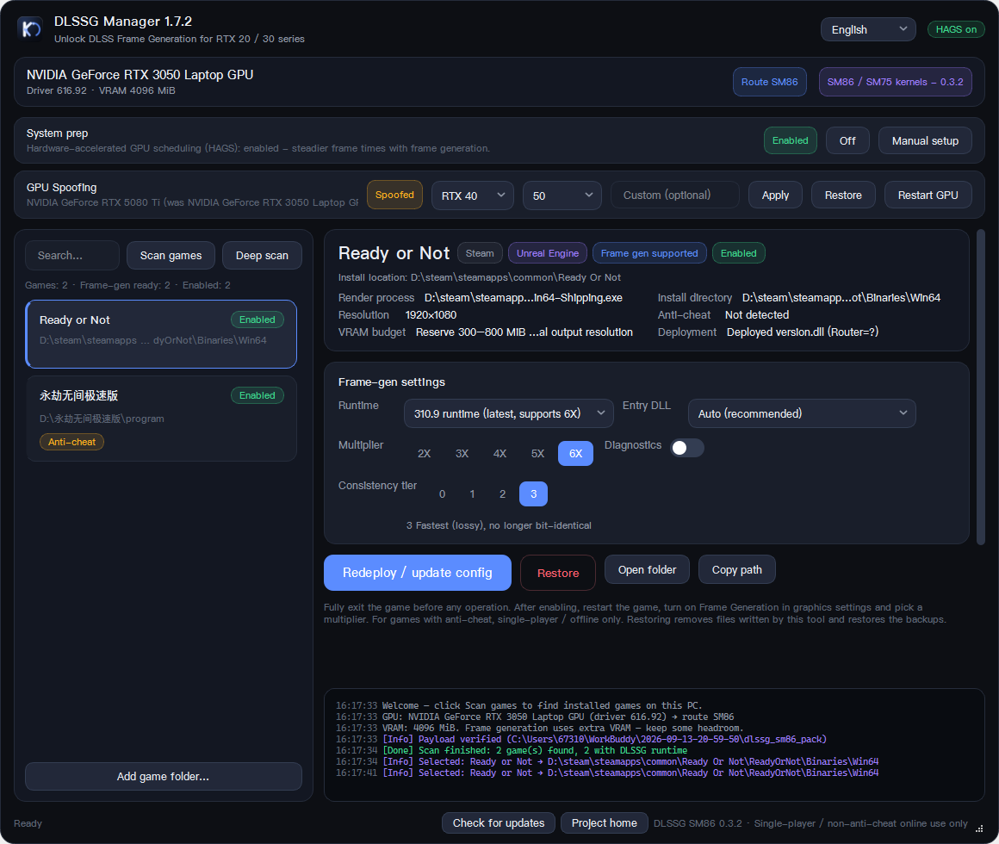
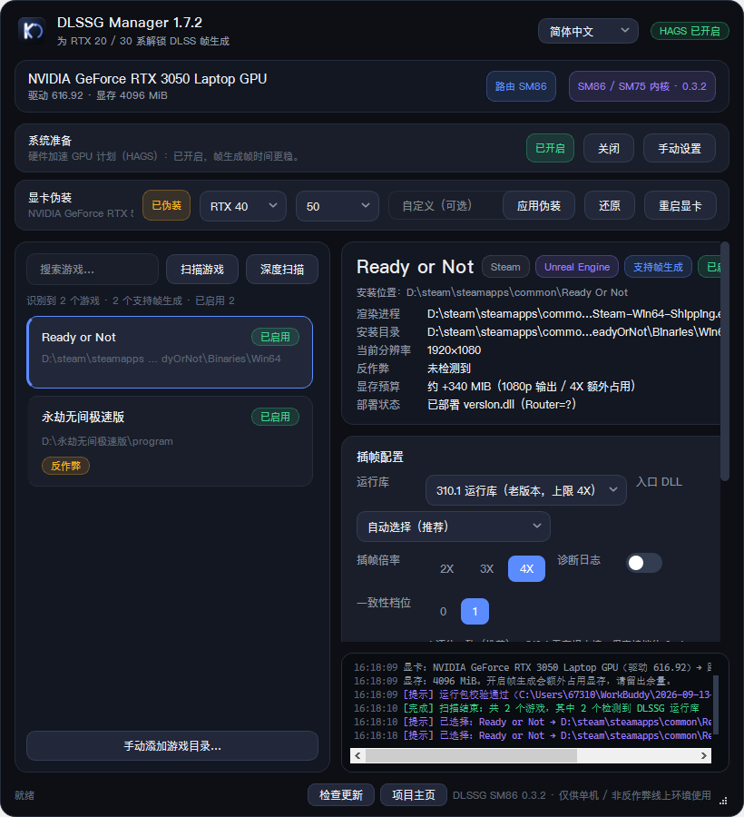

<div align="center">

# DLSSG Manager

**为 RTX 20 / 30 系显卡解锁 DLSS 帧生成的一键式图形工具**

简体中文 · 繁體中文 · English

[](#下载与安装)
[](#下载与安装)
[](#致谢与出处)

</div>

---

## 致谢与出处

> **本项目的核心能力完全来自上游项目 [dlssg_for_sm86](https://github.com/sdli1995/dlssg_for_sm86)，由 [sdli1995](https://github.com/sdli1995) 开发维护。**
>
> 正是上游作者对 DLSSG Native（`version.dll` 代理 + SM86 / SM75 内核路由）的逆向与封装，
> 才让 RTX 20 / 30 系用户用上 DLSS Frame Generation。本工具只是站在这个肩膀上，
> 把「找游戏目录、挑入口 DLL、写配置、管备份」这些繁琐步骤做成了图形界面。
>
> **向原作者致以敬意与感谢。** 上游二进制（payload/ 下的 DLL）随本工具原样分发，
> 未做任何修改，版权归原作者所有；如上游项目对你有帮助，请先去给上游一个 Star。

### 关于更新

本工具**会跟随上游项目 [dlssg_for_sm86](https://github.com/sdli1995/dlssg_for_sm86) 的更新**：

- 上游发布新版本（新的推理内核、兼容性修复等）时，
  本仓库会同步更新 `payload/` 内的运行库文件并发布新的 Release；
- 界面与识别逻辑也会跟随上游的能力边界调整（例如新显卡支持、生成帧上限变化、
  一致性档位这类语义变化）；
- 因此**建议使用最新 Release**，而不是停留在旧版本 —— 上游的兼容性修复
  往往直接决定某些游戏能不能正常开起来。

如果你发现上游已更新而本工具尚未跟进，欢迎提 issue 提醒。

DLSS 与 DLSS Frame Generation 是 NVIDIA Corporation 的商标与专有技术，
运行时依赖用户已安装的 NVIDIA 驱动组件；本仓库不包含、不修改、不分发任何 NVIDIA 专有二进制。

### 为什么做这个工具

和我一起打游戏的好友里，好几个还在用 RTX 30 系、20 系显卡。他们看到别人开帧生成，
抱怨自己的卡"没有生成"。我把原作者的项目分享给他们——GitHub 勉强访问得上，可打开
之后盯着页面看了半天，还是不知道从哪里下手。于是我把以前的老电脑翻出来，做了这个
图形工具：现在他们点两下按钮，帧生成就开起来了。

这个工具是写给他们的，也写给每一个和当时的他们一样的你。

---

## 界面预览

<div align="center">


<sub>主界面 —— 左侧游戏列表，右侧识别结果与插帧配置</sub>

</div>

<details>
<summary><b>更多截图</b>（一致性档位 / 英文界面 / 窄窗口）</summary>

<br>

**一致性档位（上游 0.3.2 新增）** —— 用 310.9 运行库时可选 0–3 四档：

<div align="center">

</div>

切到 **310.1** 运行库时自动收起为 0–1 两档（该构建没有有损内核，上游会把 2/3 当 1 处理）：

<div align="center">

</div>

**English**：

<div align="center">

</div>

**窄窗口（820×900）** —— 配置行自动换行，内容可滚动，不裁剪不重叠：

<div align="center">

</div>

</details>

---

## 这是什么

DLSSG Manager 自动扫描本机已安装的 D3D12 游戏，定位真正的渲染 EXE，
一键部署 / 一键恢复上游 DLSSG 代理与配置，让 RTX 20（SM75）/ RTX 30（SM86）
显卡在支持 DLSS 的游戏中开启**帧生成**。

### 特性一览

- **自动识别游戏**：Steam / Epic / GOG / Ubisoft 平台库 + 按盘符深度扫描 + 手动添加目录，
  自动穿透启动器定位真正渲染 EXE，并识别 Unreal / Unity 引擎
- **一键启用 / 一键恢复**：入口 DLL 自动避让（version → winmm → dbghelp → dinput8），
  绝不覆盖他人物件；部署带 SHA256 校验与自动备份，恢复还原如初
- **一致性档位（0–3）**：直接决定「生成画面能偏离官方运行库多远」——
  `0` 原厂内核（最保守）、`1` 全部逐位一致的加速（默认，**画面与官方完全相同**）、
  `2` 再加有损图像内核（PSNR ≈50 dB 以上，仅 310.9）、`3` 全部有损加速（最快）。
  切到 310.1 时 2/3 自动收起
- **两套内嵌运行库（与上游发布结构一致）**：默认 **310.9**（最新，帧倍率上限 **6X**），
  可切换 **310.1**（老版本，上限 4X）
- **分辨率感知**：读取 UE / Unity 配置估算当前分辨率，给出显存增量预算
- **反作弊提示**：检测到反作弊系统时仅作提示，不影响任何功能使用
- **系统准备**：硬件加速 GPU 计划（HAGS）检测 + 一键开关 + 跳转系统设置，帧时间更稳
- **入口分层照搬上游**：工具类代理优先（`version` → `winmm` → `dbghelp` → `dinput8`，自动选择只走这组）；
  `dxgi` / `d3d12` 属 D3D12 渲染热路径、加载顺序敏感，列为高风险并由你手动指定，**二者互斥**（部署时强制校验）
- **显卡伪装**：把显卡名称伪装成 RTX 40 / 50 系（50 / 60 / 70 / 80 / 90 及 Ti 档位），
  绕过部分游戏按型号判断的限制；支持自定义型号，随时一键还原。
  写入系统「设备实例」名称（DXGI / WMI 读取处）并提供**一键重启显卡**使改动立即生效
- **更新检测**：启动时静默检查新版本（6 小时内只查一次），发现新版本时标题栏出现可点击徽标；
  也可随时点页脚「检查更新」。**只读公开 API，不上传任何本机数据**
- **多语言**：简体中文 / 繁體中文 / English，跟随系统自动选择；
  社区可在 `lang/` 目录添加语言文件，无需重新打包
- **精致界面**：无边框圆角暗色 UI、KANNI 载入动画、macOS 风格三色窗口按钮、像素级文本省略

---

## 下载与安装

前往 [**Releases**](../../releases) 页面下载对应版本（当前 **v1.7.3**）：

| 版本 | 文件 | 适合人群 |
|---|---|---|
| **免安装便携版** | `DLSSG_Manager_1.7.3_portable_x64.zip` | 想即解压即用、绿色不写注册表 |
| **标准安装版** | `DLSSG_Manager_1.7.3_setup_x64.exe` | 想要安装向导、开始菜单/桌面快捷方式与完整卸载 |

**便携版**：解压到任意目录，双击 `DLSSG Manager.exe` 即可。
**安装版**：双击 setup，按向导选择目录安装；卸载请到「设置 → 应用 → 安装的应用」或
开始菜单里的 Uninstall，会一并清理快捷方式与注册表条目。

> 两个版本功能完全一致，都自带 `payload/` 运行库与多语言文件，**不需要安装
> Python / CUDA / 任何运行库**（2–4 秒首次解压启动属正常现象）。

---

## 使用说明

1. 启动后软件自动扫描本机游戏（也可点「深度扫描」按盘符全盘反查，或「手动添加游戏目录…」）；
2. 左侧选中游戏，右侧确认识别结果（渲染进程、分辨率、反作弊提示、部署状态）；
3. 按需选择**运行库**（310.9 / 310.1）与**一致性档位**（0–3），倍率默认 4X；
4. 点击 **「一键启用插帧」**，完全退出游戏后重新启动；
5. 在游戏画面设置里打开 **DLSS 帧生成** 并选择倍率（310.9 下最高 6X）；
6. 想还原时回到本工具点 **「一键恢复」**，游戏目录会清理干净。

更多细节（显存预算、INI 参数、排查方法、能力边界）见 [docs/使用说明.txt](docs/使用说明.txt)。

### 系统要求

| 项目 | 要求 |
|---|---|
| 系统 | Windows 10 2004+（build 19041）/ Windows 11，x64 |
| 显卡 | NVIDIA RTX 30 系（SM86）—— 上游实卡验证与出厂配置均面向 SM86；RTX 20 系（SM75）自上游 0.3.1 起恢复支持，并已由上游于 0.3.2 在 2080 Ti 实机验证 |
| 驱动 | 提供 NGX/NVAPI 接口的 NVIDIA 驱动即可 |
| 游戏 | D3D12 且内置 DLSS 运行库（工具会自动判断并提示） |

---

## 多语言

界面语言在**标题栏右上角下拉框**切换（重启程序生效），首次启动跟随系统语言。
新增语言：在程序目录新建 `lang/<语言代码>.json`（UTF-8，键为简体中文原文，值为译文，
另加 `"_meta": {"name": "语言原生名"}`），参照自带 `lang/en_US.json`，重启即可。
命令行也可用 `--lang en_US` 临时指定。

---

## 从源码构建

```bat
git clone https://github.com/kanniganfan/dlssg-manager.git
cd dlssg-manager
scripts\build_windows.bat
```

脚本会自动创建隔离 venv、安装 PySide6 + PyInstaller、打包单文件 exe 到 `dist\`。
运行需要把上游项目的 `payload/` 文件夹（version.dll + alternatives/）放在 exe 同级目录；
发布物已在 Release 附件中包含，无需自行寻找。

目录结构：

```
src/       Python 源码（core 逻辑内核 / ui 界面 / i18n 引擎 / main 入口）
lang/      界面语言文件（JSON，可直接编辑或新增语言）
assets/    图标资源
docs/      使用说明与界面截图
scripts/   构建、校验与维护脚本
```

`scripts/` 里的自检脚本（提交前会跑）：

| 脚本 | 作用 |
|---|---|
| `check_tuple_arity.py` | 校验 `ENTRIES` / `RUNTIMES` 等常量表的元组长度一致 |
| `check_i18n_keys.py` | 对比 `src/` 里 `tr()` 用到的键与词典，列出缺失 / 多余 |
| `smoke_ui.py` | 离屏 UI 冒烟：档位联动、`FlowRow` 换行、toast 定位、按钮不裁字、更新检测三态 |
| `e2e_deploy.py` | 临时目录里跑 部署 → 读回 → 恢复 闭环 |
| `build_release.py` | 打包便携版 zip + NSIS 安装器 |

---

## 能力边界与免责声明

- 仅支持 **Windows x64 + D3D12** 游戏；Vulkan 暂不支持
- 帧倍率上限取决于运行库与游戏：310.9 最高 6X（需游戏自身支持动态插帧），310.1 最高 4X；多数游戏为 4X 上限，由游戏侧插件决定
- 档位 2/3 依赖 310.9 构建里的有损图像内核，在 310.1 下不生效（界面已提前收起该选项）
- 上游实卡验证：RTX 3080 Ti（完整基准）/ RTX 3070（开发验证）/ RTX 5070；RTX 20 系（2080 Ti）已于上游 0.3.2 验证可运行
- **反作弊提示**：检测到反作弊系统时仅作提醒；请自觉只在单机 / 离线 / 实验室环境使用，
  线上模式的使用由用户自行判断与承担
- **更新检测**：启动时静默检查本工具是否有新版本（6 小时内只查一次），
  也可随时点页脚「检查更新」；发现新版本时标题栏出现可点击的版本徽标。
  检查是**只读的 GitHub 公开 API 查询，不上传任何本机数据**，也不发送任何标识信息
- 除上述更新检测外，本工具不联网、不上传任何数据，全部操作在本机完成
- 修改游戏目录前请确认已了解上述内容，使用本工具产生的一切后果由使用者自行承担

---

## 联系方式

- 邮箱：[cylqm@qq.com](mailto:cylqm@qq.com)
- 邮箱：[cao673100060@gmail.com](mailto:cao673100060@gmail.com)

欢迎 issue / PR；语言文件捐赠（任何语种）尤其欢迎。

---

## License

本项目代码以 [MIT License](LICENSE) 发布。
payload/ 内的 DLSSG 运行库归上游 [dlssg_for_sm86](https://github.com/sdli1995/dlssg_for_sm86)
原作者所有；DLSS 相关技术与商标归 NVIDIA Corporation 所有。

---

<div align="center">

**Again, all credits to [sdli1995/dlssg_for_sm86](https://github.com/sdli1995/dlssg_for_sm86)**

</div>
